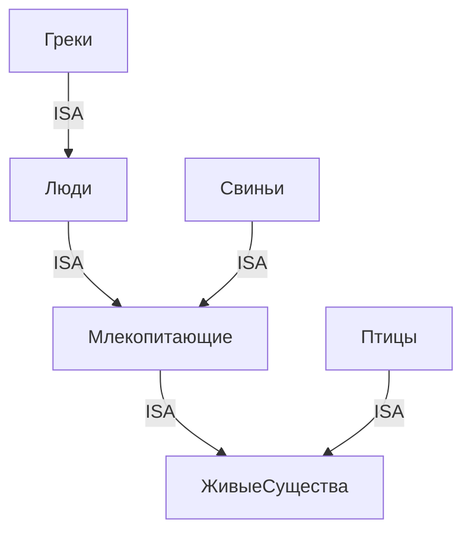

# stis_lab1

## Моделирование предметной области: Мир живых существ

### Концепты (Понятия)
- **ЖивыеСущества**  
  ├─ **Млекопитающие**  
  │   ├─ **Люди**  
  │   │   └─ **Греки**  
  │   └─ **Свиньи**  
  └─ **Птицы**

### Иерархия наследования (ISA)

### Отношение «едят»
- Семантическая связь между *агентом* (кто ест) и *объектом* (что съедается) 
- **Ограничение:** Люди не могут есть других людей

### Примеры экземпляров:

- **Аристотель** – экземпляр концепта Греки
- **Иван** – экземпляр концепта Люди (но не Грек)
- **Хрю** – экземпляр концепта Свиньи
